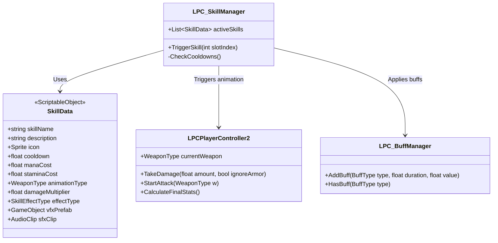

# Kế Hoạch Thiết Kế Hệ Thống Chiến Đấu & Kỹ Năng Nhân Vật

Tài liệu này đóng vai trò là bản thiết kế hệ thống chiến đấu (Combat), kỹ năng chủ động (Active Skills), hiệu ứng vũ khí (Weapon Effects) và kỹ năng nội tại (Passive Talents) cho dự án LPC Game.

---

## 1. Bản Đồ Tính Năng (Feature Matrix)

| Hệ thống | Tính năng | Chi tiết thiết kế | Trạng thái |
| :--- | :--- | :--- | :--- |
| **1. Core Combat** | Đăng ký va chạm | Sử dụng Raycast2D hoặc OverlapCircleAll trước hướng mặt khi tấn công | ⏳ Chưa bắt đầu |
| | Sát thương & Chí mạng | Tính toán sát thương vật lý/phép thuật dựa trên chỉ số thuộc tính & tỉ lệ chí mạng | ⏳ Chưa bắt đầu |
| **2. Active Skill SO** | ScriptableObject `SkillData` | Lưu cấu hình: Tên, mana/stamina, cooldown, sát thương, loại hiệu ứng, VFX/SFX | ⏳ Chưa bắt đầu |
| | Triển khai kỹ năng | Người chơi nhấn hotkey → Phát hoạt ảnh → Sinh kỹ năng tương ứng (đòn chém lan, bắn tên...) | ⏳ Chưa bắt đầu |
| **3. Weapon Effects** | Kiếm 1 tay (`OneHand_Slash`)| Tăng tỉ lệ chém lan (Cleave) đòn đánh thường | ⏳ Chưa bắt đầu |
| | Giáo/Thương (`Thrust`) | Tăng xuyên giáp, cơ hội gây xuất huyết (Bleed) | ⏳ Chưa bắt đầu |
| | Cung tên (`Bow_Shoot`) | Tăng sát thương theo cự ly, bắn tên xuyên | ⏳ Chưa bắt đầu |
| | Trượng phép (`Spell`) | Hồi mana khi đánh thường, kích hoạt quả cầu phép | ⏳ Chưa bắt đầu |
| **4. Passive Talents** | Hệ Sức Mạnh (STR) | Cuồng nộ: Dưới 30% máu tăng 40% ATK và nhận 8% hút máu | ⏳ Chưa bắt đầu |
| | Hệ Khéo Léo (DEX) | Nhất kích tất sát: Mỗi đòn thứ 3 chắc chắn chí mạng | ⏳ Chưa bắt đầu |
| | Hệ Trí Tuệ (INT) | Ma pháp quá tải: Tăng 20% sát thương kỹ năng nhưng tốn thêm 10% MP | ⏳ Chưa bắt đầu |
| | Hệ Thể Chất (VIT) | Kháng cự: Tăng giáp ảo (Shield) dựa trên lượng máu đã mất | ⏳ Chưa bắt đầu |
| | Hệ Nhanh Nhẹn (AGI) | Bộ pháp gió: Né tránh thành công tăng 30% tốc độ chạy | ⏳ Chưa bắt đầu |
| **5. Game Feel** | Floating Damage Text | Hiện số sát thương nhảy màu sắc phân biệt (Vật lý, Chí mạng, Phép, Đốt...) | ⏳ Chưa bắt đầu |
| | Hit Stop | Khựng hình 0.05s khi chém trúng kẻ địch để tạo cảm giác nặng lực | ⏳ Chưa bắt đầu |
| | Camera Shake | Rung màn hình khi chém chí mạng hoặc dùng kỹ năng mạnh | ⏳ Chưa bắt đầu |

---

## 2. Kiến Trúc Lớp (Class Architecture)

---

## 3. Lộ Trình Triển Khai (Execution Phases)

### 📌 Pha 1: Core Combat & Game Feel (Nền tảng cảm giác)
1. **Xử lý va chạm chém trúng (Hit Registration)**: Code logic kiểm tra kiếm/tên có chạm trúng kẻ địch hay không.
2. **Số sát thương nhảy (Floating Damage Text)**: Tạo Prefab chữ số sử dụng TextMeshPro, bay lên và nhạt dần khi kẻ địch nhận sát thương.
3. **Hiệu ứng Khựng hình (Hit Stop)**: Viết hàm Coroutine tạm hoãn thời gian hoặc tốc độ Animator trong 0.05s khi phát hiện trúng đòn.

### 📌 Pha 2: Hệ Thống Kỹ Năng ScriptableObject & VFX
1. **Tạo `SkillData` ScriptableObject**: Cho phép tạo các file kỹ năng trong Unity Editor.
2. **Nâng cấp `LPC_SkillManager.cs`**: Đọc từ danh sách `SkillData` thay vì các cấu hình cứng như trước.
3. **Hệ thống tạo đạn/hiệu ứng (Skill Projectiles/Cleave)**: Viết script cho cầu lửa bay đi hoặc vệt chém xoáy xoay xung quanh người.

### 📌 Pha 3: Nội Tại Vũ Khí & Thiên Phú Thập Chỉ Số
1. **Tích hợp Nội tại vũ khí**: Cập nhật hàm tấn công để áp dụng hiệu ứng chí mạng, chém lan, hoặc xuất huyết dựa trên vũ khí đang mang.
2. **Hệ thống Thiên phú (Passive Talent)**: Tạo hệ thống kỹ năng nội tại tự động kích hoạt dựa trên chỉ số thuộc tính hiện có (STR, DEX, INT...).
